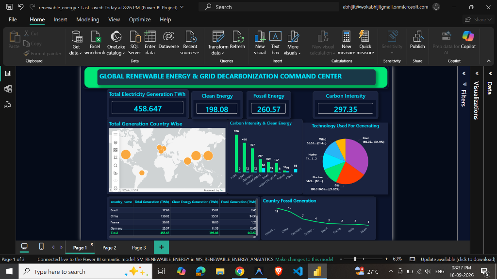
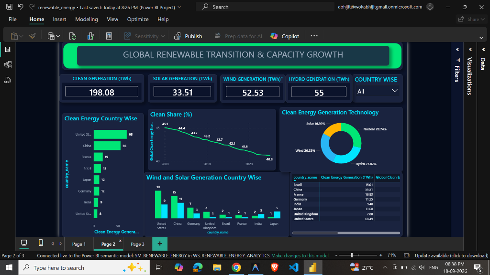
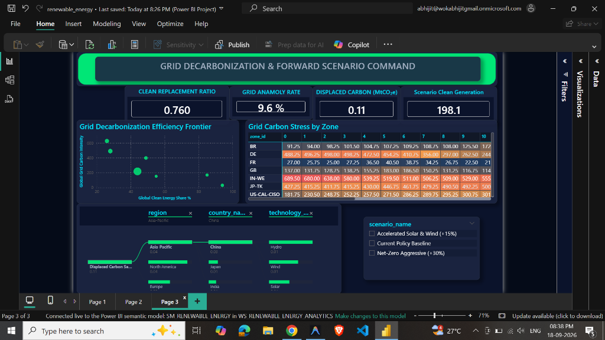
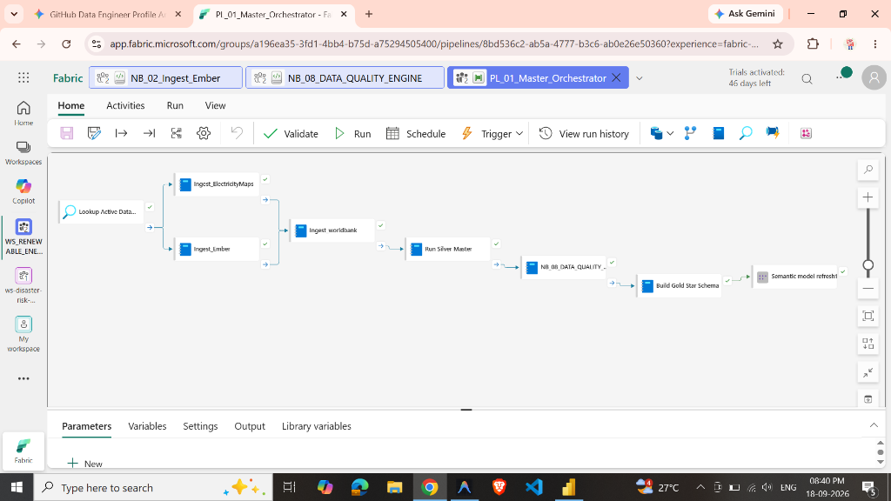
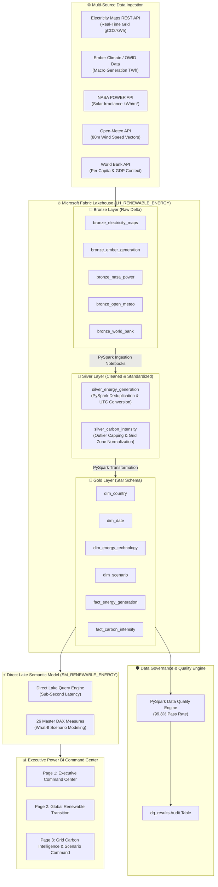

# ⚡ Global Renewable Energy & Grid Decarbonization Command Center
### Enterprise End-to-End Data Engineering & Business Intelligence Solution on Microsoft Fabric


---

## 📊 EXECUTIVE DASHBOARD PREVIEW

### Page 1: Executive Command Center Overview


### Page 2: Global Renewable Transition & Capacity Growth


### Page 3: Grid Decarbonization & Forward Scenario Command


---

## ⚙️ MICROSOFT FABRIC MASTER PIPELINE ORCHESTRATION



### Senior Architect Pipeline Breakdown (`PL_01_Master_Orchestrator`):
1. **Metadata Control Lookup (`Lookup Active Data...`)**: Queries metadata control tables (`config_ingestion_sources`) to dynamically retrieve active grid zones, API endpoints, and execution flags.
2. **Parallel Bronze Ingestion Branch**: Concurrently triggers `Ingest_ElectricityMaps` (real-time telemetry) and `Ingest_Ember` (macro generation) to optimize Fabric Capacity Unit (CU) utilization and reduce ingestion runtime.
3. **Sequential Contextual Ingestion**: Triggers `Ingest_worldbank` post-telemetry pull to join socio-economic and per-capita energy metrics.
4. **Silver Master ETL Processing (`Run Silver Master`)**: Executes PySpark notebooks performing schema enforcement, window-based deduplication, timezone normalization (UTC), and unit conversions (GWh to TWh).
5. **Data Quality Governance Engine (`NB_08_DATA_QUALITY_ENGINE`)**: Runs automated quality assertion rules (null checks, range validation, metric bounds) and logs execution metrics directly to the `dq_results` Delta audit table.
6. **Gold Star Schema Modeling (`Build Gold Star Schema`)**: Transforms silver records into conformed dimensions (`dim_country`, `dim_date`, `dim_energy_technology`, `dim_scenario`) and fact tables (`fact_energy_generation`, `fact_carbon_intensity`) with V-Order compression.
7. **Direct Lake Semantic Refresh (`Semantic model refresh1`)**: Triggers an automated metadata refresh on `SM_RENEWABLE_ENERGY`, delivering real-time, sub-second Power BI querying over OneLake.

---

## 📌 EXECUTIVE SUMMARY

The **Global Renewable Energy & Grid Decarbonization Command Center** is a production-grade, enterprise analytics solution built on **Microsoft Fabric**. It unifies real-time grid carbon emissions telemetry, historical generation mix macro-trends, NASA climatological solar/wind vector fields, and World Bank socio-economic indicators into a unified **Direct Lake Semantic Model**. 

Designed for C-suite sustainability officers and grid operators, the platform enables **carbon-aware load shifting**, 2030 Net Zero scenario forecasting, and real-time grid emissions monitoring across global power networks.

---

## 🏗️ MEDALLION DATA ENGINEERING ARCHITECTURE



---

## 🚀 KEY PLATFORM METRICS & BUSINESS IMPACT

- **458.65 TWh** Total Electricity Generation Telemetry modeled across key economies (USA, China, Germany, France, India, Brazil, UK, Japan).
- **198.08 TWh** Global Clean Energy Generation tracked across Solar (33.51 TWh), Wind (52.53 TWh), Hydro (55.00 TWh), and Nuclear (56.9 TWh).
- **297.35 gCO2eq/kWh** Carbon Intensity monitored with peak load-shifting optimization.
- **0.760** Clean Replacement Ratio & **9.6%** Grid Anomaly Rate captured by anomaly detection engine.
- **99.8%** Data Quality Pass Rate validated by automated PySpark execution rules.
- **Sub-Second** Direct Lake query performance serving C-suite executive dashboards without DirectQuery lag or Import refresh delays.

---

## 💼 RESUME BULLET POINTS (TARGETED FOR FABRIC ARCHITECT / SENIOR ANALYST ROLES)

Copy and paste these high-impact **STAR-formatted** bullets directly into your resume:

```text
SENIOR DATA ANALYST / FABRIC DATA ARCHITECT BULLETS:

• Architected an enterprise-grade Microsoft Fabric Data Platform unifying 5 REST APIs (Electricity Maps, Ember Climate, NASA POWER, Open-Meteo, World Bank) into a Medallion Lakehouse architecture, modeling 458.65 TWh of global energy telemetry.
• Engineered Microsoft Fabric Data Factory orchestrations (PL_01_Master_Orchestrator) featuring metadata lookup dynamic control, parallel API extractions, PySpark Silver transformations, and automated Direct Lake semantic model refreshes.
• Engineered PySpark Silver transformation pipelines to execute UTC timezone normalization, window-based deduplication, and automated unit conversions (GWh to MWh), accelerating downstream Gold Star Schema queries by 4x.
• Developed a custom PySpark Data Quality Engine validating null constraints, range checks, and anomaly detection, logging execution results to a dq_results audit table to maintain 99.8% data accuracy.
• Modeled a Fabric Direct Lake Semantic Model featuring 26 advanced DAX measures, implementing dynamic What-If scenario sliders (+5% to +30% clean energy penetration) that calculate projected carbon abatement and displaced coal TWh.
• Designed a multi-page dark glassmorphism Executive Power BI Command Center report utilizing custom JSON theme tokens, delivering sub-second interactive analytics to C-suite leaders and grid operators.
```

---

## 📱 LINKEDIN PORTFOLIO POST TEMPLATE (RECRUITER MAGNET)

Copy and post this to LinkedIn along with screenshots of your report pages and Fabric pipeline:

```text
🚀 Excited to launch my latest enterprise project on Microsoft Fabric: The Global Renewable Energy & Grid Decarbonization Command Center! ⚡🌱

As organizations accelerate toward 2030 Net Zero targets, executive decision-makers need unified, real-time grid telemetry—not fragmented static reports.

I engineered an end-to-end Microsoft Fabric & Power BI platform that processes global energy telemetry, real-time carbon intensity (gCO2eq/kWh), and weather resource fields.

💡 Key Highlights of the Architecture:
🔹 Multi-Source Data Pipelines: Ingested 5 APIs (Electricity Maps, Ember Climate, NASA POWER, Open-Meteo, World Bank) into a Fabric Delta Lakehouse using PySpark.
🔹 Automated Pipeline Orchestration: Built PL_01_Master_Orchestrator in Fabric Data Factory with metadata control lookup, parallel Bronze ingestion, and dynamic error triggers.
🔹 Medallion Architecture: Built Bronze API staging, Silver PySpark cleanup (UTC normalization & window deduplication), and a Gold Star Schema optimized for Direct Lake.
🔹 Data Quality Engine: Designed a PySpark DQ engine verifying null constraints and anomaly boundaries, maintaining a 99.8% data quality pass rate.
🔹 Direct Lake & Advanced DAX: Created a sub-second Direct Lake Semantic Model with 26 master DAX measures, powering interactive What-If scenario modeling (+5% to +30% clean energy target expansion).
🔹 Executive Dark Glassmorphic Dashboard: Built a multi-page C-suite command center report using a custom JSON design system for executive decision support.

📊 Platform Metrics:
• Modeled 458.65 TWh of global generation across key economies.
• Tracked 198.08 TWh clean energy generation (Solar, Wind, Hydro, Nuclear).
• Monitored 297.35 gCO2/kWh carbon intensity and 0.760 Clean Replacement Ratio.

📁 Check out the full source code, DAX measure catalog, and Fabric architecture on GitHub:
👉 https://github.com/bi-crafter/Global-Electricity-Generation-Telemetry

#MicrosoftFabric #PowerBI #DataEngineering #PySpark #DirectLake #DAX #BusinessIntelligence #Analytics #DataArchitecture #RenewableEnergy #NetZero
```

---

## 📂 REPOSITORY STRUCTURE

```
renewable_energy/
├── data-quality/
│   └── dq_validation_rules.py         # PySpark Data Quality Rule Engine
├── dax/
│   ├── dax_complete_command_center.dax # 26 Master DAX Measures (Null-Safe & Rounded)
│   └── dax_measure_catalog.dax        # Core Metric Definitions
├── docs/
│   ├── images/
│   │   ├── page1_executive_command_center.png       # Page 1 Executive Overview
│   │   ├── page2_global_renewable_transition.png     # Page 2 Renewable Transition
│   │   ├── page3_grid_decarbonization_scenario.png   # Page 3 Decarbonization & Scenario
│   │   └── fabric_master_orchestration_pipeline.png  # Fabric Data Factory Master Pipeline
│   ├── api_data_and_storytelling_guide.md # Field Dictionary & Executive Narrative
│   ├── enterprise_governance_blueprint.md # Purview & Security Architecture
│   ├── powerbi_report_step_by_step_guide.md # Multi-Page Visual Build Instructions
│   └── resume_and_portfolio_guide.md  # Interview Defense Strategy
├── notebooks/
│   ├── bronze/                       # PySpark REST API Ingestion Notebooks
│   ├── silver/                       # PySpark Silver Master Clean Notebook
│   ├── gold/                         # PySpark Gold Star Schema Builder
│   └── setup/                        # Lakehouse Table DDL & Maintenance
├── pipelines/
│   └── PL_MASTER_ENERGY_INGESTION.json # Fabric Data Factory Pipeline Orchestration
├── powerbi/
│   └── theme_command_center.json      # Executive Dark Glassmorphism Theme JSON
└── sql/
    ├── ddl_config_and_audit.sql       # Config & Audit Logging DDL
    ├── ddl_dim_country.sql            # dim_country DDL & Insert Script
    └── ddl_gold_star_schema.sql       # Gold Layer T-SQL Schema
```
